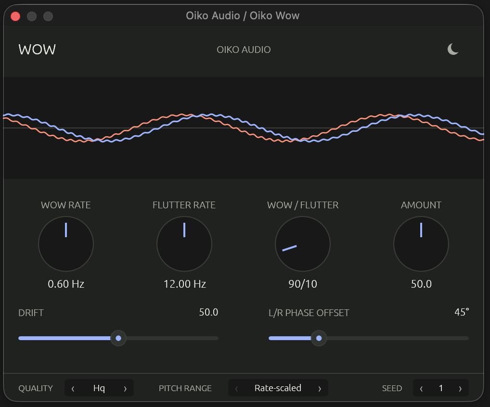
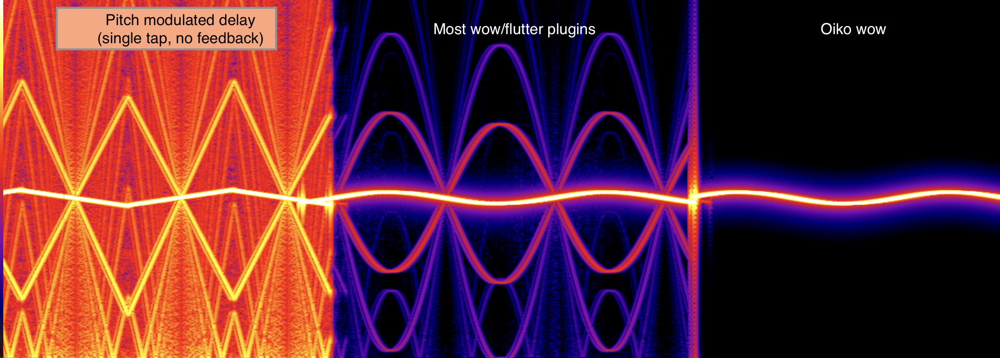

# Wow

> **This repository is archived.** Wow is now developed in [oikoaudio/oikoaudio](https://github.com/oikoaudio/oikoaudio/tree/main/plugins/wow), together with our other plugins. Get current builds from [oikoaudio.com/downloads](https://oikoaudio.com/downloads/#wow) and report bugs with the [bug report form](https://github.com/oikoaudio/oikoaudio/issues/new?template=bug-report.yml).

> **Public beta — v0.1.1-beta.3.** Oiko Wow is ready for testing, but the
> builds are unsigned and should not yet be trusted in irreplaceable sessions.

**[Download beta builds](https://github.com/oikoaudio/wow/releases/tag/v0.1.1-beta.3)**
for macOS, Windows, and Linux.

Wow is a free and open-source pitch-modulation plug-in for macOS, Windows, and Linux. It creates slow warble, fast flutter, and natural drift by continuously changing playback speed, without adding saturation, hiss, dropouts, or EQ.

It captures the soft, unsteady feeling of unstable pitch while suppressing unrelated digital artifacts from conventional interpolation. The effect ranges from subtle movement to deliberately extreme modulation.



## Why clean modulation matters

Changing playback speed means reading audio between its stored samples. A simple interpolator is inexpensive, but it can add high-frequency loss, unrelated tones, and aliasing near Nyquist. These artifacts are separate from the sidebands produced by pitch modulation itself.

Wow uses a polyphase windowed-sinc fractional-delay reader. When playback speeds up, its low-pass cutoff follows the instantaneous rate so frequencies that would cross the output Nyquist limit are removed before they can fold back. The filter banks are built outside the audio thread and interpolated smoothly during processing. Physically correct FM sidebands remain, while additional interpolation spurs and foldback are treated as errors.

HQ mode is the default. Normal and Ultra trade processing cost against progressively tighter spectral accuracy, while Draft retains a simpler cubic interpolator for comparison and low-cost use.

The distinction matters most on exposed high frequencies and when several modulated signals are layered. It also gives the same DSP core a clean basis for future modulated-delay and feedback effects.



*Identical input, modulation depth, sample rate, level, FFT settings, and render duration. Competing products anonymized.*

## Controls

- **Wow Rate** sets the slow oscillator from 0.1 to 4 Hz.
- **Flutter Rate** sets the fast oscillator from 6 to 30 Hz.
- **Wow / Flutter** blends their contributions with a constant-power law.
- **Amount** controls the total pitch movement.
- **Drift** adds repeatable, smoothly changing variation to both oscillator
  rates.
- **L/R Phase Offset** separates the left and right modulation phases by up to 180 degrees without introducing a separate chorus or widening process.

The display shows the combined left and right motion produced by the current
settings. Random Seed makes Drift repeatable when a session is reopened.

New instances open at 0.6 Hz Wow, 12 Hz Flutter, a 90/10 Wow/Flutter balance,
50% Amount, 50% Drift, and a mono-linked 0° L/R phase offset.

The footer contains two less frequently changed settings:

- **Quality:** Draft, Normal, HQ, or Ultra. HQ is the default.
- **Pitch Range:** Rate-scaled keeps the delay excursion bounded, so faster
  settings produce greater pitch movement. Constant keeps the perceived pitch range more consistent across oscillator rates and requires more latency.

At 48 kHz, Rate-scaled reports about 8.0 ms of latency. Constant mode reports about 34.2 ms. The host is responsible for compensating that latency.

## Formats and platforms

Wow exports mono and stereo **CLAP** and **VST3** plug-ins for:

- macOS on Apple Silicon and Intel;
- Windows x86-64;
- Linux x86-64.

The current builds are unsigned public-beta builds and are not yet notarized.
Operating-system security warnings are therefore expected. Only install an
archive downloaded from this repository.

## Installing the beta

Download the archive for your platform from the beta release and
copy either or both plug-in bundles to the appropriate user or system folder:

| Platform | CLAP | VST3 |
|---|---|---|
| macOS | `~/Library/Audio/Plug-Ins/CLAP` | `~/Library/Audio/Plug-Ins/VST3` |
| Windows | `C:\Program Files\Common Files\CLAP` | `C:\Program Files\Common Files\VST3` |
| Linux | `~/.clap` | `~/.vst3` |

Restart the DAW and rescan its plug-ins after installation. Because this beta
is unsigned, macOS and Windows may require you to explicitly allow it in the
operating system's security settings.

## Beta testing and reports

Compatibility reports, automation behaviour, sound at extreme settings, and
general usability feedback are especially useful. Please use the
[beta report form](https://github.com/oikoaudio/wow/issues/new?template=beta-report.yml)
and include the operating system, DAW and version, plug-in format, sample rate,
buffer size, and exact reproduction steps.

Known beta limitations:

- builds are not signed or notarized;
- changing Pitch Range changes reported latency and may make the host restart
  processing;
- Draft quality is a deliberately lower-cost audition mode rather than the
  cleanest production setting;
- host and platform compatibility is still being established through this
  beta.

## Signal quality

Normal, HQ, and Ultra use rate-aware windowed-sinc readers with 80, 96, and 128
taps respectively. Their low-pass cutoff follows the instantaneous playback
rate, preserving nearly the full input band around normal speed while
suppressing frequencies that would otherwise fold below Nyquist. Draft uses a
lower-cost cubic interpolator for auditioning and comparison.

## Building

Install a current stable Rust toolchain, then run from the repository root:

```sh
cargo test --workspace
cargo run -p xtask --release -- bundle wow-plugin --release
```

`Oiko Wow.clap` and `Oiko Wow.vst3` are written to `target/bundled/`.

On macOS, build universal Apple Silicon and Intel CLAP and VST3 bundles with:

```sh
scripts/build-macos-universal.sh
```

Audio Unit distribution is temporarily disabled because the AUv2 editor crashes
Logic Pro's out-of-process Audio Unit host on macOS 26 despite passing `auval`.
The AU packaging project remains in the repository for explicit compatibility
testing after the upstream GUI-hosting path is fixed.

The GitHub Actions workflow tests the workspace and creates downloadable native archives for Linux x86-64, Windows x86-64, macOS Apple Silicon, and macOS Intel on pushes to `main`, pull requests, version tags, and manual runs.

## Repository layout

```text
crates/wow-dsp    Host-independent, real-time DSP core
crates/wow-plugin CLAP/VST3 wrapper and native editor
docs/images       Release images
xtask             Cross-platform plug-in bundle builder
```

## License

MIT
